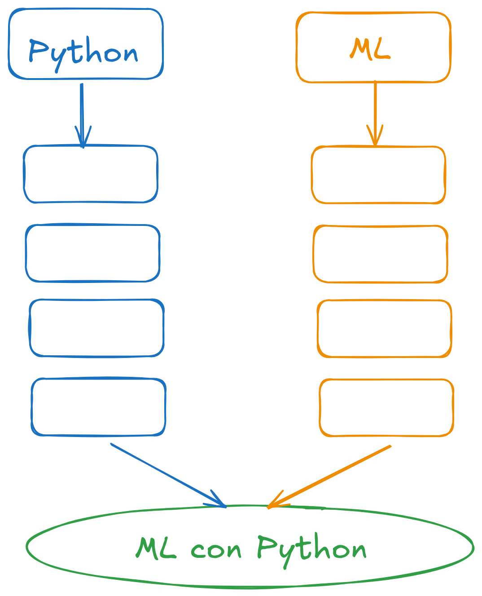

# Machine Learning con Python



---

## Introducción a Python

| Título / Topic | Colab |
| :--- | :--- |
| Python básico: Sesion 1 | [](https://colab.research.google.com/github/gypsaman/Python-ML/blob/master/notebooks/Py-sesion1.ipynb) |
| Python básico: Sesion 2 | [](https://colab.research.google.com/github/gypsaman/Python-ML/blob/master/notebooks/Py-sesion2.ipynb) |
| Python Modulos: NumPy, Pandas, Matplotlib. | [](https://colab.research.google.com/github/gypsaman/Python-ML/blob/master/notebooks/Python_modules.ipynb) |
| Python básico: Sesion 3. | [](https://colab.research.google.com/github/gypsaman/Python-ML/blob/master/notebooks/Py-sesion3.ipynb) |
| Python básico: Sesion 4. | [](https://colab.research.google.com/github/gypsaman/Python-ML/blob/master/notebooks/Py-sesion4.ipynb) |
| Python básico: Sesion 5. | [](https://colab.research.google.com/github/gypsaman/Python-ML/blob/master/notebooks/Py-sesion5.ipynb) |
| ML algoritmos clásicos: regresión, árboles, SVM. | [](https://colab.research.google.com/github/gypsaman/Python-ML/blob/master/notebooks/modelos_clasicos_ml_demo.ipynb) |

```
- ⚠️ **Estas son versiones read-only.**
- No usar:  *File → Save changes to GitHub*.
- En vez de eso, usa: **File → Save a copy in Drive** para crear tu propia copia editable.
```

