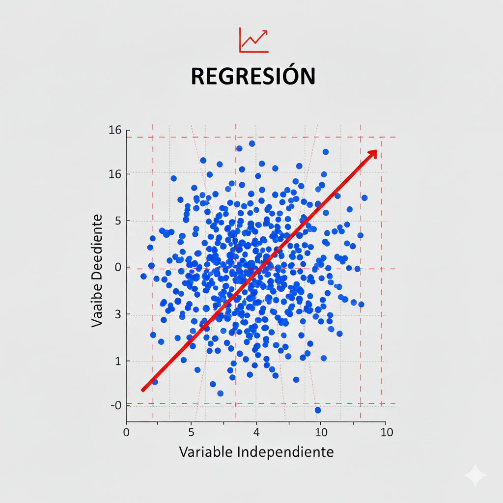
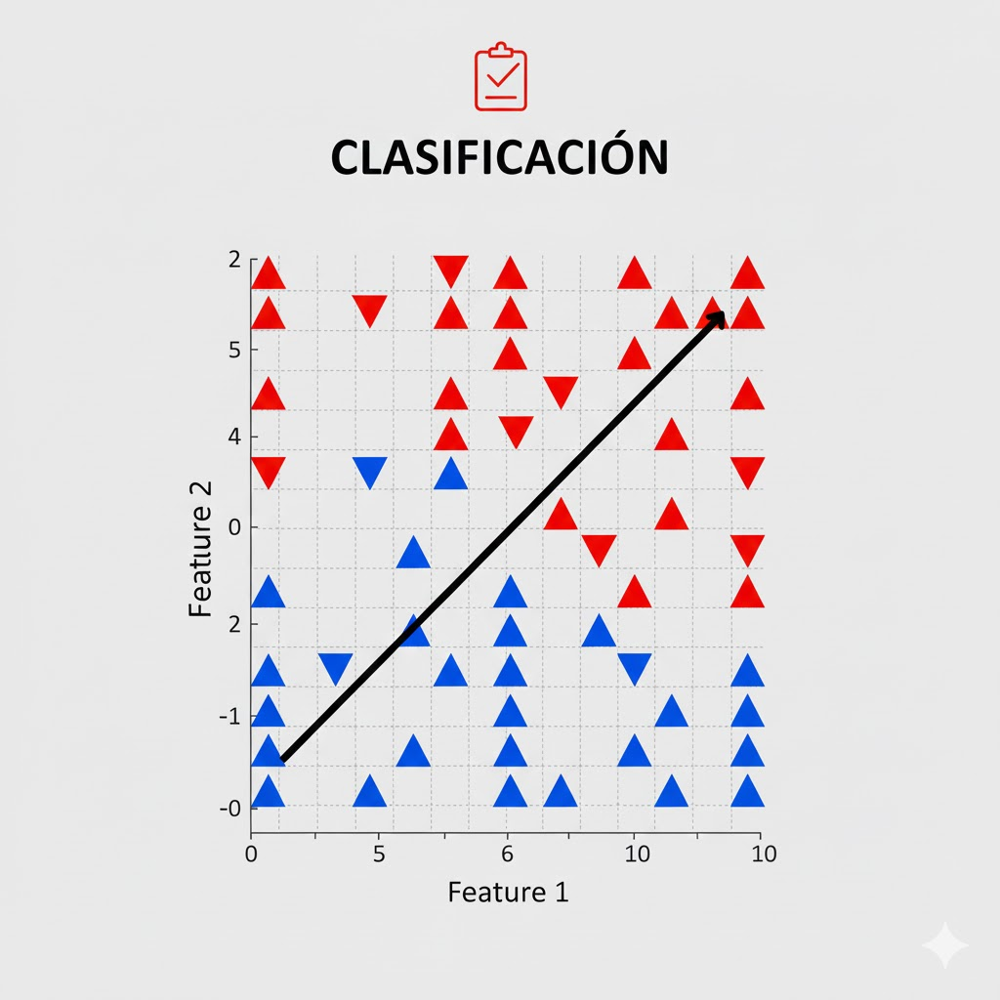
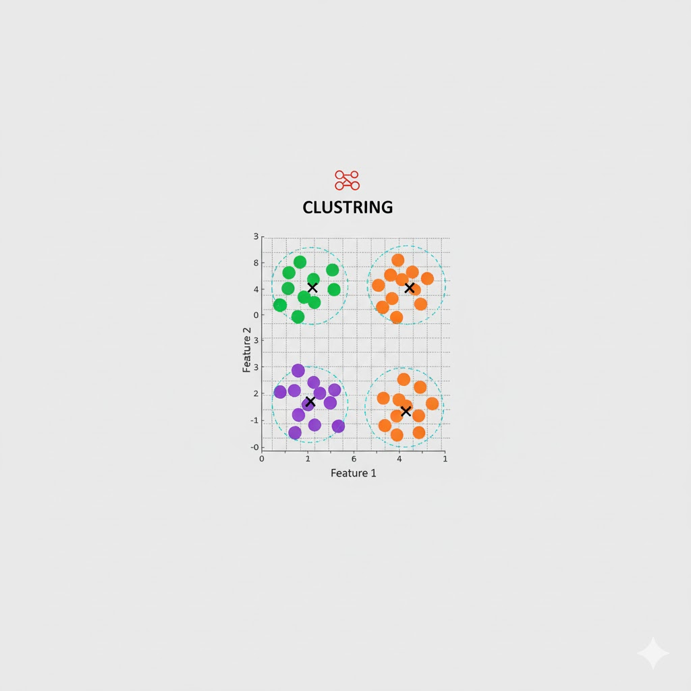
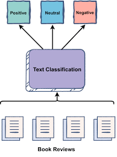

# Introducción

**Objetivos de la sesión**

- Comprender qué es el aprendizaje automático (Machine Learning).
- Diferenciar entre aprendizaje clásico y aprendizaje profundo.
- Identificar tipos de problemas: regresión, clasificación, clustering.
- Revision de algoritmos classicos: 
  - regresión lineal, 
  - KNN, 
  - árboles de decisión, 
  - SVM.

---

# ¿Qué es el Machine Learning?

## Definición
El Machine Learning permite a los sistemas aprender patrones a partir de datos sin ser programados explícitamente.

---

# Por qué funciona el Machine Learning

##

- El ML identifica patrones que no son evidentes a primera vista de los datos.
- Aprende relaciones multivariadas donde cada variable influye en combinación con otras.
- Encuentra fronteras de decisión o reglas matemáticas imposibles de deducir manualmente.
- Aprovecha grandes volúmenes de datos para reducir ruido y generalizar a nuevos casos.

## Ejemplo intuitivo

Detección de fraude en tarjetas de crédito:

- No hay una única señal clara de fraude.
- El ML aprende combinaciones sutiles: hora + monto + ubicación + historial + categoría del comercio.
- Los humanos jamás podrían ver todos esos patrones simultáneamente.

---

# Tipos de Problemas

##

| **Tarea**       | **Descripción**               | **Imagen** |
|-----------------|-------------------------------|------------|
| **Regresión**   | Predicción de valores numéricos. | {height=50px} |
| **Clasificación** | Asignación de categorías.       | {height=50px} |
| **Clustering**  | Agrupación sin etiquetas.      | {height=50px} |
| **Lenguaje Natural (NLP)** | Procesamiento de texto y voz.  | {height=50px} |

---

# Algoritmos Aprendizaje Supervisado
## Algoritmos Clásicos
- Regresión lineal/polinomial  
- KNN  
- Árboles de decisión  
- Random Forests  
- Support Vector Machines (SVM)

## Deep Learning (Redes Neuronales)
- Redes Feedforward (FNN)
- Convolucionales (CNN)  
- Recurrentes (RNN, LSTM)  
- Variational Autoencoders (VAE)
- Ganerative Adversarial Networks (GAN)
- Transformers (ChatGPT, Gemeni)

---

# Regresión lineal – Características

- **Ventajas**
  - Muy interpretables: cada coeficiente indica el efecto de una variable.
  - Entrenamiento rápido incluso con muchos datos.
  - Buena base para entender otros modelos.
- **Desventajas**
  - No captura relaciones altamente no lineales.
  - Sensible a outliers.
  - Supone cierta estructura en los datos (linealidad, homocedasticidad, etc.).

---

# Regresión polinomial

- Idea: si la relación no es lineal, **ampliamos las características**.
- Ejemplo (una variable):
    $\hat{y} = w_0 + w_1 x + w_2 x^2 + w_3 x^3$
- En la práctica:
  - Creamos nuevas columnas: $( x, x^2, x^3, \cdots )$
  - Aplicamos regresión lineal sobre estas características.

- **Cuidado**:
  - Grado muy alto riesgo de **sobreajuste**.
  - Se suele combinar con **regularización** (Ridge, Lasso).

---

# K-Nearest Neighbors (KNN) – Intuición

- No construye una fórmula explícita, sino que **memoriza los datos**.
- Para predecir un nuevo punto:
  1. Busca los **k vecinos más cercanos** en el conjunto de entrenamiento.
  2. Clasificación: votación mayoritaria entre las clases de esos vecinos.
  3. Regresión: promedio de los valores numéricos de los vecinos.

- Depende fuertemente de la **noción de distancia** (normalmente Euclídea).

---

# KNN – Ventajas y desventajas

- **Ventajas**
  - Sencillo de entender e implementar.
  - Puede modelar fronteras de decisión muy complejas.
  - No necesita entrenamiento costoso (el “costo” está en la predicción).

- **Desventajas**
  - Lento para predecir con muchos datos (hay que buscar vecinos).
  - Muy sensible a:
    - Escala de las características (es necesario normalizar).
    - Elección de k.
  - Mal rendimiento en espacios de alta dimensión (“maldición de la dimensionalidad”).

---

# KNN – Hiperparámetros clave

- k: número de vecinos.
  - k muy pequeño -> sobreajuste.
  - k muy grande -> subajuste.
- Tipo de distancia:
  - Euclídea, Manhattan, Minkowski, Coseno etc.
- Peso de los vecinos:
  - Todos iguales.
  - O ponderados por distancia (más peso a vecinos más cercanos).

---

# Árboles de decisión – Intuición

- Modelo que aprende una secuencia de **decisiones tipo “si/entonces”**.
- Estructura en forma de árbol:
  - Nodo interno: condición (ej. “¿edad > 30?”).
  - Rama: resultado de la condición (sí/no).
  - Hoja: predicción final (clase o valor numérico).

- Objetivo: dividir el espacio de características en regiones cada vez más “puras”.

---

# Árboles de decisión – Construcción

- En cada nodo:
  - Se prueba dividir los datos por alguna característica y umbral.
  - Se mide qué tan “buena” es la división:
    - Clasificación: Gini, entropía.
    - Regresión: reducción de MSE.
  - Se elige la división que **mejor separa** las clases o reduce el error.
- Se repite recursivamente hasta:
  - Profundidad máxima.
  - Número mínimo de muestras por hoja.
  - O hasta que ya no mejore la pureza.

---

# Árboles de decisión – Pros y contras

- **Ventajas**
  - Muy interpretables (se puede visualizar el árbol).
  - Manejan bien variables categóricas y numéricas.
  - Capturan relaciones no lineales y efectos de interacción.

- **Desventajas**
  - Un solo árbol profundo tiende a **sobreajustar**.
  - Pequeños cambios en los datos pueden generar árboles muy diferentes.
  - Menor rendimiento que ensambles como Random Forests o Gradient Boosting.

---

# Random Forests – Intuición

- Un **ensamble de árboles de decisión**.
- En vez de entrenar un solo árbol:
  - Se entrenan muchos árboles sobre diferentes subconjuntos de datos y características.
  - Clasificación: votación mayoritaria entre árboles.
  - Regresión: promedio de las predicciones.

- Idea clave: muchos modelos débiles -> un modelo fuerte mediante **promediado**.

---

# Random Forests – Aleatoriedad controlada

- Dos fuentes de aleatoriedad:
  - **Bootstrap**: cada árbol ve una muestra aleatoria (con reemplazo) del conjunto de entrenamiento.
  - **Subconjunto de características**: en cada división del árbol, se considera sólo un subconjunto aleatorio de variables.

- Beneficios:
  - Reduce varianza (menos sobreajuste que un solo árbol).
  - Maneja bien datos ruidosos y características irrelevantes.

---

# Random Forests – Características

- **Ventajas**
  - Buen rendimiento “out of the box”.
  - Menos sobreajuste que un único árbol.
  - Proporciona medidas de **importancia de variables**.

- **Desventajas**
  - Menos interpretable que un árbol individual.
  - Modelo más pesado y más lento en predicción que un solo árbol.
  - Muchos hiperparámetros posibles (número de árboles, profundidad, etc.).

---

# Random Forests – Hiperparámetros clave

- n_estimators: número de árboles.
- Profundidad máxima de cada árbol.
- Número mínimo de muestras por hoja o por división.
- Número de características consideradas en cada división.

::: notes
Comenta que en la práctica muchos frameworks dan buenos valores por defecto; el ajuste fino se puede hacer más adelante.
:::

---

# Support Vector Machines (SVM) – Intuición

- Problema típico: **clasificación binaria**.
- Objetivo: encontrar un **hiperplano** que separe las clases con el **mayor margen posible**.
- Los puntos más cercanos al hiperplano se llaman **vectores de soporte**:
  - Son los puntos “críticos” que definen la frontera.

- Intuición: entre todas las fronteras que separan las clases, SVM elige la que ofrece más “colchón” (margen).

---

# SVM – Margen y errores

- En datos perfectamente separables:
  - Se busca maximizar la distancia entre las clases y el hiperplano.
- En datos reales (con ruido):
  - Se permite cierta cantidad de errores controlados por el parámetro $C$.
  - $C$ alto -> menos errores, margen más ajustado (riesgo de sobreajuste).
  - $C$ bajo -> más errores permitidos, margen más ancho (mejor generalización).

---

# SVM – Kernel trick

- Cuando los datos **no son linealmente separables** en el espacio original:
  - Se usan **kernels** para proyectarlos implícitamente a un espacio de mayor dimensión.
- Kernels comunes:
  - Lineal
  - Polinomial
  - RBF (Radial Basis Function / Gaussiano)
- El kernel RBF es muy utilizado por su capacidad de modelar fronteras complejas.

---

# SVM – Ventajas y desventajas

- **Ventajas**
  - Buen rendimiento en problemas con pocas muestras y alta dimensión.
  - Puede aprender fronteras de decisión muy complejas (con kernels).
  - Basado en un principio teórico sólido (maximización del margen).

- **Desventajas**
  - Entrenamiento costoso con conjuntos de datos muy grandes.
  - Menos interpretable que modelos lineales o árboles.
  - Requiere cuidado al elegir kernel, $C$ y parámetros como $\gamma$.

---

# Comparación rápida de modelos

| Modelo                | Mejor para...                       | Riesgo principal              |
|-----------------------|-------------------------------------|-------------------------------|
| Regresión Lineal      | Relaciones simples, interpretable   | Subajuste en no lineales      |
| KNN                   | Fronteras complejas                 | Lento en grandes datos        |
| Árboles/Random Forest | No linealidades e interacciones     | Sobreajuste (árbol único)     |
| SVM                   | Alta dimensión y no lineal (kernel) | Costoso en datasets grandes   |
---