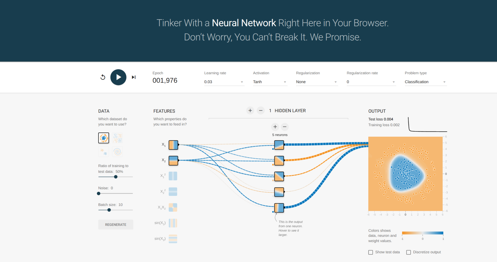

# Objetivos

- Comprender neuronas artificiales.
- Conocer pesos, bias (sesgo), activaciones.
- Entender flujo de información (forward propagation).
- Familiarizarse con funciones de activación comunes.

---

# ¿Qué es una Red Neuronal?

\small

Una red neuronal es una función compuesta por varias transformaciones simples:

### 1. **Capas**

- **Capa de entrada:** recibe las características del problema.
- **Capas ocultas:** combinan pesos, sesgos y activaciones para aprender patrones.
- **Capa de salida:** produce la predicción final.

### 2. **Neuronas**

Cada neurona realiza:

$$
z = W x + b
\qquad\Rightarrow\qquad
a = f(z)
$$

### 3. **Conexiones y aprendizaje**

- Pesos que conectan una capa con la siguiente.
- La red ajusta estos pesos durante el entrenamiento para minimizar el error.

---

# Red Neural

\centering
\begin{tikzpicture}[
x=1.0cm, y=1.0cm,
scale=0.7,
every node/.style={transform shape},
neuron/.style={circle, draw, minimum size=6mm},
connection/.style={-latex}
]

% Input layer
\node[neuron] (I1) at (0,2) {};
\node[neuron] (I2) at (0,0) {};
\node[neuron] (I3) at (0,-2) {};

% Hidden layer (5 neurons)
\node[neuron] (H1) at (3,4) {};
\node[neuron] (H2) at (3,2) {};
\node[neuron] (H3) at (3,0) {};
\node[neuron] (H4) at (3,-2) {};
\node[neuron] (H5) at (3,-4) {};

% Output layer (2 neurons)
\node[neuron] (O1) at (6,1) {};
\node[neuron] (O2) at (6,-1) {};

% Connections: Input -> Hidden
\foreach \i in {I1,I2,I3}{
\foreach \h in {H1,H2,H3,H4,H5}{
\draw[connection] (\i) -- (\h);
}
}

% Connections: Hidden -> Output
\foreach \h in {H1,H2,H3,H4,H5}{
\foreach \o in {O1,O2}{
\draw[connection] (\h) -- (\o);
}
}

% Labels
\node at (-2.8,0) {Datos de entrada};
\node at (3,-5.3) {Capa oculta};
\node at (7,0) {salida};

\end{tikzpicture}

---

# Perceptron

\centering
\begin{tikzpicture}[
scale=0.9,
neuron/.style={circle, draw, minimum size=12mm, thick},
smallnode/.style={circle, draw, minimum size=8mm, thick},
arrow/.style={-latex, thick},
font=\large
]

% Inputs
\node (X1) at (0,1.5) {$x_1$};
\node (X2) at (0,0) {$x_2$};
\node (X3) at (0,-1.5){$x_3$};

% Summation node
\node[neuron] (SUM) at (4,0) {$\Sigma$};

% Bias value (no arrow from above)
\node (B) at (4,2.2) {}; % empty placeholder (keeps geometry)

% Addition node
\node[smallnode] (ADD) at (6,0) {$+$};

% Activation box
\node[draw, minimum width=16mm, minimum height=10mm, right=1.5cm of ADD] (ACT) {$f(\cdot)$};

% Output node y
\node[neuron, right=1.8cm of ACT] (YNODE) {$y$};

% Input arrows + weights
\draw[arrow] (X1) -- node[above] {$w_1$} (SUM);
\draw[arrow] (X2) -- node[above] {$w_2$} (SUM);
\draw[arrow] (X3) -- node[below] {$w_3$} (SUM);

% Summation -> addition
\draw[arrow] (SUM) -- (ADD);

% Bias -> addition (rewrite as +b next to arrow)
\draw[arrow] (4,2.2) -- node[right] {$b$} (ADD);

% Addition -> activation -> y node
\draw[arrow] (ADD) -- (ACT);
\draw[arrow] (ACT) -- (YNODE);

% Bottom centered formula
\node[below=2.2cm of ACT, align=center]
{
$y = f\!\left(\sum_{i=1}^{n} w_i x_i + b\right)$
};

\end{tikzpicture}

---

# Todo es Algebra Lineal

\centering
\begin{tikzpicture}[
node distance=10mm,
every node/.style={font=\large}
]

% Title for the operation
\node (eq) at (0,2) {$z = W x + b$};

% Weight matrix W (5x3)
\node (W) at (-4,0)
{
$\displaystyle
W =
\begin{bmatrix}
w*{11} & w*{12} & w*{13} \\
w*{21} & w*{22} & w*{23} \\
w*{31} & w*{32} & w*{33} \\
w*{41} & w*{42} & w*{43} \\
w*{51} & w*{52} & w*{53}
\end{bmatrix}*{5\times 3}
$
};

% Input vector x (3x1)
\node[right=12mm of W] (x)
{
$\displaystyle
x =
\begin{bmatrix}
x*1 \\
x_2 \\
x_3
\end{bmatrix}*{3\times 1}
$
};

% Plus sign
\node[right=8mm of x] (plus) {$+$};

% Bias vector b (5x1)
\node[right=8mm of plus] (b)
{
$\displaystyle
b =
\begin{bmatrix}
b*1 \\
b_2 \\
b_3 \\
b_4 \\
b_5
\end{bmatrix}*{5\times 1}
$
};

% Equals sign
\node[right=8mm of b] (equals) {$=$};

% Output vector z (5x1)
\node[right=8mm of equals] (z)
{
$\displaystyle
z =
\begin{bmatrix}
z*1 \\
z_2 \\
z_3 \\
z_4 \\
z_5
\end{bmatrix}*{5\times 1}
$
};

\end{tikzpicture}

---

# Forward Propagation

## Propagación hacia adelante (Forward Propagation)

- Tomamos las entradas $(x)$ del modelo.
- En cada capa calculamos una combinación lineal: $(z = W x + b)$.
- Aplicamos una función de activación: $(a = f(z))$.
- Repetimos capa por capa hasta obtener la salida $(\hat{y})$.

\vspace{0.5cm}

## Ejemplo: red con 1 capa oculta

$$
\begin{aligned}
z^{(1)} &= W^{(1)} x + b^{(1)} \\
a^{(1)} &= f\bigl(z^{(1)}\bigr) \\
z^{(2)} &= W^{(2)} a^{(1)} + b^{(2)} \\
\hat{y} &= g\bigl(z^{(2)}\bigr)
\end{aligned}
$$

---

# Funciones de activación

**¿Qué es una función de activación?**

- Es una transformación no lineal aplicada después de la combinación lineal $z = Wx + b$.
- Permite que la red neuronal aprenda funciones complejas, no sólo líneas rectas.
- Sin activaciones no lineales, toda la red sería equivalente a una sola transformación lineal.
- Diferentes activaciones producen comportamientos distintos en el aprendizaje.

---

## ¿Por qué necesitamos no linealidad?

**Idea clave**

- Cada capa lineal realiza una transformación del tipo $z = Wx + b$.
- Si encadenamos varias capas solo lineales (sin función de activación), la composición sigue siendo **otra transformación lineal**.
- Eso significa que una “red profunda” sin activaciones no lineales sería equivalente a **una sola capa lineal**.
- No podríamos aproximar funciones complejas ni separar datos con fronteras no lineales.

---

## ¿Por qué necesitamos no linealidad?

**Viendolo del punto de vista Algebraico**

$$
\begin{aligned}
z^{(1)} &= W^{(1)} x + b^{(1)} \\
z^{(2)} &= W^{(2)} z^{(1)} + b^{(2)} \\
        &= W^{(2)}\bigl(W^{(1)} x + b^{(1)}\bigr) + b^{(2)} \\
        &= \bigl(W^{(2)} W^{(1)}\bigr) x + \bigl(W^{(2)} b^{(1)} + b^{(2)}\bigr)
\end{aligned}
$$

Sigue siendo de la forma:
$$z^{(2)} = W^{*} x + b^{*}$$
es decir, **lineal**.

---

# ¿Por qué necesitamos no linealidad?

### Visualización

\centering
\begin{tikzpicture}[scale=0.9,>=latex]

% Ejes
\draw[->] (-3,0) -- (3,0) node[right] {$x_1$};
\draw[->] (0,-3) -- (0,3) node[above] {$x_2$};

% Clase roja (centro)
\fill[red] (0,0) circle (3pt);
\fill[red] (0.3,0.2) circle (3pt);
\fill[red] (-0.2,-0.3) circle (3pt);
\fill[red] (0.1,-0.2) circle (3pt);

% Clase azul (anillo alrededor)
\foreach \ang in {0,30,...,330} {
\fill[blue] ({2*cos(\ang)},{2*sin(\ang)}) circle (3pt);
}

% Frontera lineal (no sirve)
\draw[thick] (-2.8,-2.2) -- (2.8,2.2)
node[above right] {\small frontera lineal};

% Frontera no lineal (círculo)
\draw[thick,dashed] (0,0) circle (1.3)
node[below right] {\small frontera no lineal};

\end{tikzpicture}

\medskip

\centering
\small
Una recta no puede separar las clases,  
pero una frontera curva (no lineal) sí.

---

# Teorema de Aproximación Universal

Un perceptrón multicapa (MLP) con **una sola capa oculta**, pero con suficientes neuronas, puede aproximar **cualquier función continua** en un conjunto compacto. Esto requiere una función de activación **no lineal** (ReLU, Sigmoid, Tanh, etc.).

## Enunciado formal

> Para toda función continua $f: \mathbb{R}^n \to \mathbb{R}$; y para todo $\varepsilon > 0$,  
> existe una red neuronal con **una capa oculta** y una activación no lineal $f(\cdot)$ tal que la red aproxima a $f$ con un error menor que $\varepsilon$. en todo el dominio compacto.

##

- En teoría, **no necesitamos muchas capas** para representar funciones complejas.
- En la práctica, las redes profundas aprenden **mejor, más rápido y con menos neuronas** que una red extremadamente ancha de una sola capa.

---

# Funciones de Activación

## Funciones de activación comunes

- ReLU
- Sigmoid
- Tanh
- GELU

## Otras populares (includidas para referencia)

- Leaky ReLU
- ELU
- Swish (SiLU)

## Popular para salidas

- Softmax

---

# Función de activación: ReLU

## Rectified Linear Unit (ReLU)

- Deja pasar solo valores positivos.
- Muy usada en redes profundas por su simplicidad y buen comportamiento en la práctica.
- Problema: neuronas pueden “morir” si la entrada es siempre negativa.

$$
\text{ReLU}(x) = \max(0, x)
$$

## Visualización

\centering
\begin{tikzpicture}[scale=0.7]
% Ejes
\draw[->] (-3,0) -- (3,0) node[right] {$x$};
\draw[->] (0,-0.2) -- (0,3) node[above] {$f(x)$};
% ReLU
\draw[thick] (-3,0) -- (0,0);
\draw[thick] (0,0) -- (3,3);
\end{tikzpicture}

---

# Función de activación: Sigmoide

## Sigmoid / logística

- Comprime cualquier valor real al intervalo $(0, 1)$.
- Interpretación probabilística: salida como “probabilidad”.
- Problema: gradientes muy pequeños para valores grandes en magnitud (saturación).

$$
\sigma(x) = \frac{1}{1 + e^{-x}}
$$

## Visualización

\centering
\begin{tikzpicture}[scale=0.7]
% Ejes
\draw[->] (-6,0) -- (6,0) node[right] {$x$};
\draw[->] (0,-0.1) -- (0,1.2) node[above] {$\sigma(x)$};
% Sigmoide
\draw[thick,domain=-6:6,samples=100]
plot (\x,{1/(1+exp(-\x))});
% Líneas guía
\draw[dashed] (-6,1) -- (6,1);
\draw[dashed] (-6,0) -- (6,0);
\end{tikzpicture}

---

# Función de activación: Tanh

## Tangente hiperbólica

- Similar a la sigmoide pero centrada en 0.
- Rango en $(-1, 1)$.
- Útil cuando queremos activaciones con media cercana a cero.

$$
\tanh(x) = \frac{e^{x} - e^{-x}}{e^{x} + e^{-x}}
$$

## Visualización

\centering
\begin{tikzpicture}[scale=0.7]
% Ejes
\draw[->] (-6,0) -- (6,0) node[right] {$x$};
\draw[->] (0,-1.5) -- (0,1.5) node[above] {$\tanh(x)$};
% Tanh
\draw[thick,domain=-6:6,samples=100]
plot (\x,{tanh(\x)});
% Líneas guía
\draw[dashed] (-6,1) -- (6,1);
\draw[dashed] (-6,-1) -- (6,-1);
\end{tikzpicture}

---

## Función de activación: GELU {.fragile}

## Gaussian Error Linear Unit (GELU)
- Suaviza la ReLU usando una distribución normal.
- Muy popular en modelos modernos (por ejemplo, Transformers).
- Activa más fuertemente valores positivos grandes, pero de forma suave.

Definición conceptual:

$$  
\text{GELU}(x) = x \,\Phi(x)
  $$

donde $$ \Phi(x) $$ es la CDF de la normal estándar.

Aproximación práctica usada en la mayoría de implementaciones:

$$  
\text{GELU}(x) \approx 0.5\,x\Bigl(1 + \tanh\bigl(\sqrt{2/\pi}\,(x + 0.044715\,x^{3})\bigr)\Bigr)
  $$

## Visualización {.fragile}

\centering
\begin{tikzpicture}[scale=0.7]
  % Ejes
  \draw[->] (-4,0) -- (4,0) node[right] {$x$};
  \draw[->] (0,-0.8) -- (0,4) node[above] {$\text{GELU}(x)$};
  % Aproximación precisa de GELU
  \draw[thick,domain=-4:4,samples=200,smooth]
    plot (\x,{0.5*\x*(1 + tanh(sqrt(2/pi)*(\x + 0.044715*\x*\x*\x)))});
\end{tikzpicture}

---

# Función de activación: Softmax

## Softmax

- Convierte un vector de scores en un vector de probabilidades.
- Muy usada en la capa de salida para clasificación multiclase.
- La suma de las salidas es 1.

Para una salida de dimensión $K$:

$$
\text{softmax}(z)_i = \frac{e^{z_i}}{\sum_{j=1}^{K} e^{z_j}}, \quad i = 1,\dots,K
$$

**Ejemplo numérico**  
Entrada $z = [2.0, 1.0, 0.1]$  
$e^z \approx [7.389, 2.718, 1.105]$  
Suma $= 11.212$  
$\text{softmax}(z) \approx [0.66, 0.24, 0.10]$

---

## Visualización

\centering
\begin{tikzpicture}[node distance=12mm, font=\large]
% Vector de entrada z
\node (zlabel) at (0,1.5) {$z$};
\node[draw,minimum width=10mm,minimum height=6mm] (z1) at (0,0.7) {$z_1$};
\node[draw,minimum width=10mm,minimum height=6mm] (z2) at (0,0) {$z_2$};
\node[draw,minimum width=10mm,minimum height=6mm] (z3) at (0,-0.7) {$z_3$};

% Caja softmax
\node[draw,rounded corners,minimum width=20mm,minimum height=18mm,right=18mm of z2] (soft) {softmax};

% Vector de salida p
\node (plabel) at (5,1.5) {$p$};
\node[draw,minimum width=12mm,minimum height=6mm,right=18mm of soft.north] (p1) {$p_1$};
\node[draw,minimum width=12mm,minimum height=6mm,right=18mm of soft] (p2) {$p_2$};
\node[draw,minimum width=12mm,minimum height=6mm,right=18mm of soft.south] (p3) {$p_3$};

% Flechas entrada -> softmax
\draw[->] (z1.east) -- (soft.west|-z1.east);
\draw[->] (z2.east) -- (soft.west);
\draw[->] (z3.east) -- (soft.west|-z3.east);

% Flechas softmax -> salida
\draw[->] (soft.east|-p1.west) -- (p1.west);
\draw[->] (soft.east) -- (p2.west);
\draw[->] (soft.east|-p3.west) -- (p3.west);
\end{tikzpicture}

---

# Funciones de Activación – Comparación

## Visualización

\centering
\begin{tikzpicture}[scale=0.8, >=latex]

% Ejes
\draw[->] (-4,0) -- (4,0) node[right] {$z$};
\draw[->] (0,-1.5) -- (0,4) node[above] {$f(z)$};

% ReLU (azul)
\draw[thick, blue] (-4,0) -- (0,0) -- (4,4) node[right] {\small ReLU};

% Sigmoid (rojo)
\draw[thick, red, domain=-4:4,samples=100]
plot (\x,{1/(1+exp(-\x))}) node[below right] {\small Sigmoide};

% Tanh (verde)
\draw[thick, green!60!black, domain=-4:4,samples=100]
plot (\x,{tanh(\x)}) node[above right] {\small Tanh};

% GELU (morado)
\draw[thick, purple, domain=-4:4,samples=150,smooth]
  plot (\x,{0.5*\x*(1 + tanh(sqrt(2/pi)*(\x + 0.044715*\x*\x*\x)))}) node[below left] {\small GELU};

\end{tikzpicture}

---

# Función de activación: Leaky ReLU

## Leaky Rectified Linear Unit

- Variante de ReLU que permite un pequeño gradiente cuando $x < 0$.
- Evita el problema de “neuronas muertas”.
- Parámetro $\alpha$ controla la pendiente en la parte negativa (típicamente $\alpha = 0.01$).

$$
\text{LeakyReLU}(x) =
\begin{cases}
x, & x \ge 0 \\
\alpha x, & x < 0
\end{cases}
$$

## Visualización

\centering
\begin{tikzpicture}[scale=0.7]
% Ejes
\draw[->] (-4,0) -- (4,0) node[right] {$x$};
\draw[->] (0,-1.5) -- (0,4) node[above] {$f(x)$};

% Leaky ReLU con alpha = 0.1 (para mayor visibilidad)
\draw[thick,domain=-4:0] plot (\x,{0.1\*\x});
\draw[thick,domain=0:4] plot (\x,{\x});
\end{tikzpicture}

---

# Función de activación: ELU

## Exponential Linear Unit (ELU)

- Similar a ReLU para $x \ge 0$, pero suave en la parte negativa.
- Produce activaciones negativas que ayudan a centrar la salida alrededor de 0.

$$
\text{ELU}(x) =
\begin{cases}
x, & x \ge 0 \\
\alpha \bigl(e^{x} - 1\bigr), & x < 0
\end{cases}
$$

Típicamente $\alpha = 1$.

## Visualización

\centering
\begin{tikzpicture}[scale=0.7]
% Ejes
\draw[->] (-4,0) -- (4,0) node[right] {$x$};
\draw[->] (0,-2) -- (0,4) node[above] {$f(x)$};

% ELU con alpha = 1
\draw[thick,domain=-4:0,samples=100]
plot (\x,{exp(\x)-1});
\draw[thick,domain=0:4] plot (\x,{\x});
\end{tikzpicture}

---

# Función de activación: Swish (SiLU)

## Swish / SiLU - Sigmoid Linear Unit

- Activación moderna usada en redes eficientes (EfficientNet, etc.).
- Similar a GELU en comportamiento.

$$
\text{Swish}(x) = x \,\sigma(x) = \frac{x}{1 + e^{-x}}
$$

## Visualización

\centering
\begin{tikzpicture}[scale=0.7]
% Ejes
\draw[->] (-5,0) -- (5,0) node[right] {$x$};
\draw[->] (0,-0.5) -- (0,5) node[above] {$f(x)$};

% Swish: x \* sigmoid(x)
\draw[thick,domain=-5:5,samples=150]
plot (\x,{\x/(1 + exp(-\x))});
\end{tikzpicture}

---

# Tensorflow Playground

---
