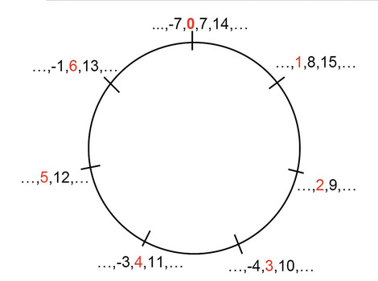

# Modular Math

## Definition x $\pmod n$ 
- remainder of $\frac{x}{n}$

##

|             |             |              |
| ----------- | ----------- | ------------ |
| 0 mod 4 = 0 | 4 mod 4 = 0 | 8 mod 4 = 0  |
| 1 mod 4 = 1 | 5 mod 4 = 1 | 9 mod 4 = 1  |
| 2 mod 4 = 2 | 6 mod 4 = 2 | 10 mod 4 = 2 |
| 3 mod 4 = 3 | 7 mod 4 = 3 | 11 mod 4 = 3 |

# Modular Math

{ width=250px }

# Modular Math

## Modular equivalence: $x \equiv y \pmod n$

$$ 1 \equiv 5 (\bmod 4) $$
$$ x^2 \equiv y \bmod 4 $$
$$ (m^e)^d \equiv m (\bmod n) $$